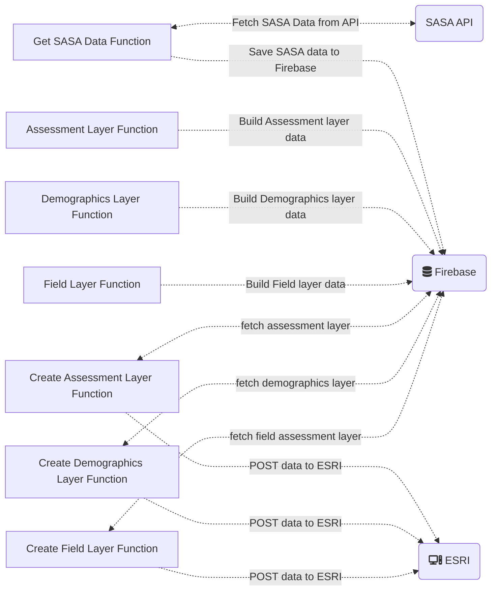

# SASA-Esri Integration

## Description
This system was designed to integrate data between the SASA API and ArcGIS.

### Tools used
The following tools were used to build up this system:
- [Firebase](https://firebase.google.com/)
- [Cloud Functions](https://firebase.google.com/docs/functions)
- [ArcGIS Online](https://www.arcgis.com/index.html)
- SASA API

## High-level flow-chart
Below is a high-level flow-chart which gives us a visual representation of how all our cloud functions will be executed.



As listed above, the main components include the `SASA API`, `Firebase` which contains our cloud functions and database, and `ESRI` or `ArcGIS` which is used to visualise our stored data.

## Cloud functions
We have 7 (seven) functions that all run concurrently, are triggered by a CRON job, and process data:

### Get SASA Data Function
This function runs at 04:50am (GMT+2) each day, and fetches all the SASA data, then writes it to our `Firebase Realtime Database` (this works well with storing and processing JSON data).

<details>
  <summary>
    Sample SASA Data
  </summary>

  ```json
      {
    "uuid": "c461154f-cb7f-49db-aa32-2a31db405039",
    "msisdn": "27833939595",
    "partner_identifier": null,
    "name": "Renen W",
    "created_at": "2022-09-01T11:44:04.561Z",
    "updated_at": "2022-09-22T15:04:15.310Z",
    "is_ca_aware": false,
    "demographic": {
      "gender": null,
      "birthdate": null,
      "level_of_education": null,
      "work_type": null,
      "employment_status": null,
      "notes": null,
      "marital_status": null,
      "identity_type": null,
      "identity_number": null,
      "relations": [],
      "geographic_0": null,
      "geographic_1": null,
      "geographic_2": null,
      "geographic_3": null,
      "disability": null,
      "disability_detail": null,
      "primary_language": null,
      "age": null,
      "income": null,
      "income_period": null,
      "location": null,
      "home_location": null,
      "work_location": null,
      "created_at": "2022-09-01T11:44:04.761Z",
      "updated_at": "2022-09-01T11:44:04.761Z"
    },
    "farm": null,
    "economic": {
      "dependants": null,
      "transport": null,
      "income_period": null,
      "income": 0,
      "adjusted_nett_pay": 0,
      "nett_pay": 0
    },
    "fields": [],
    "assessments": []
  }
```
</details>

### Assessment Layer Function
This function runs in 30 min intervals. It checks whether there are any rows that have not been processed, if this case is true, it will process data and store it in a separate table in the format required by ArcGIS, which makes it easier to
extract and POST data to our feature service.

Sample Assessment Layer Data:
<details>
  <summary>
    Assessment Layer Data
  </summary>

  ```json
    {
      "assessmentLayerCreated": true,
      "attributes": {
        "assessment_type": "FieldSurvey",
        "cover_crop": true,
        "created_at": "2023-03-10T10:00:49.088Z",
        "customer_uuid": "08dbf069-7b62-4519-aaf0-68d3ba63f717",
        "distance_to_homestead": 65,
        "field_uuid": "282d3ddb-1d6f-4378-91f8-07e890e999f5",
        "ownership": "Family Plot (shared with Family)",
        "people_supported_by_field": 3,
        "uuid": "0059d7d5-b2c4-48e7-8455-78e5c26dc793"
      },
      "geometry": {
        "spatialReference": {
          "wkid": 4326
        },
        "x": 5.70722,
        "y": 50.8284
      },
      "isLocationEmpty": true,
      "lastUpdated": 1696532075307,
      "reasonFailure": "No location to process"
    }
  ```
</details>

### Demographics Layer Function
This function runs in 30 min intervals and checks whether there are any rows that have not been processed, if this case is true, it will process the data and store it
in a separate schema in the format required by ArcGIS.

Sample Demographics Layer Data:
<details>
  <summary>
    Demographics Layer Data
  </summary>

  ```json
    {
      "attributes": {
        "farmer_name": "000d41c5 F03b 4814 8ceb Cc80cdd739a5",
        "farmer_uuid": "000d41c5-f03b-4814-8ceb-cc80cdd739a5",
        "identity_number": "236920200",
        "identity_type": "national_id"
      },
      "featureLayerCreated": true,
      "isLocationEmpty": true,
      "lastUpdated": 1695142143372,
      "reasonFailure": "No location to process"
    }
  ```
</details>

### Field Layer Function (Polygon layer)
This function runs in 30 min intervals and checks whether there are any rows that have not been procesed, if this case is true, it will process
the data and store it in a separate schema in the format required by ArcGIS.

Sample Field Layer Data:
<details>
  <summary>
    Field Layer Data
  </summary>

  ```json
    {
      "attributes": {
        "expected_production_unit": "tons",
        "farmer_created_at": "2023-03-11T06:36:23.401Z",
        "farmer_field_uuid": "01596e83-74b5-42e3-a9b4-64dff4ba1cdb",
        "farmer_gender": "female",
        "farmer_identity_number": "236920200",
        "farmer_identity_type": "national_id",
        "farmer_name": "Ruth Mochotlhi",
        "farmer_updated_at": "2023-03-11T07:31:39.314Z",
        "farmer_uuid": "2c3bb9ed-4354-4a8b-ad9e-bad285074b29",
        "perimeter": 68,
        "status": "new"
      },
      "featureLayerCreated": true,
      "geometry": {
        "rings": [
          [
            [
              22.6547664,
              -18.7958816
            ],
            [
              22.6547681,
              -18.7958802
            ],
            [
              22.6547727,
              -18.7958789
            ],
            [
              22.6547808,
              -18.7958796
            ],
            [
              22.6547911,
              -18.7958789
            ],
            [
              22.6548077,
              -18.7958748
            ],
            [
              22.6548229,
              -18.7958733
            ],
            [
              22.6548386,
              -18.7958692
            ],
            [
              22.6548516,
              -18.7958666
            ],
            [
              22.6548632,
              -18.7958645
            ],
            [
              22.6548757,
              -18.7958642
            ],
            [
              22.6548897,
              -18.7958643
            ],
            [
              22.6549027,
              -18.795863
            ],
            [
              22.6549146,
              -18.7958587
            ],
            [
              22.6549273,
              -18.795855
            ],
            [
              22.6549404,
              -18.7958505
            ],
            [
              22.6549526,
              -18.7958443
            ],
            [
              22.6549641,
              -18.7958347
            ],
            [
              22.6549739,
              -18.7958205
            ],
            [
              22.654978,
              -18.7958061
            ],
            [
              22.6549765,
              -18.7957908
            ],
            [
              22.6549736,
              -18.7957757
            ],
            [
              22.6549732,
              -18.7957595
            ],
            [
              22.6549697,
              -18.7957433
            ],
            [
              22.654965,
              -18.7957291
            ],
            [
              22.6549591,
              -18.7957151
            ],
            [
              22.6549522,
              -18.7957037
            ],
            [
              22.6549428,
              -18.7956963
            ],
            [
              22.6549308,
              -18.7956928
            ],
            [
              22.6549182,
              -18.7956906
            ],
            [
              22.654915,
              -18.7956933
            ],
            [
              22.6548395,
              -18.7957924
            ],
            [
              22.6548265,
              -18.7958257
            ],
            [
              22.6548139,
              -18.7958337
            ],
            [
              22.6548071,
              -18.7958427
            ],
            [
              22.6548022,
              -18.7958483
            ],
            [
              22.6547664,
              -18.7958816
            ]
          ]
        ],
        "spatialReference": {
          "wkid": 4326
        }
      },
      "lastUpdated": 1695151684805
    }
  ```
</details>

### Create Assessment Layer, Create Demographics Layer and Create Field Layer functions
All 3 of these functions are responsible for processing data from their respective data points. Each function runs in 30 min intervals
and is used to process data. Once the data is extracted, it will be sent to ArcGIS via a POST request. These are the 3 endpoints which are hosted on ArcGIS:

- POINT_LAYER_FEATURE_SERVICE="https://services-eu1.arcgis.com/gq4tFiP3X79azbdV/arcgis/rest/services/Farmer_Demographic_Layer/FeatureServer/0"
- POLYGON_FEATURE_SERVICE="https://services-eu1.arcgis.com/gq4tFiP3X79azbdV/arcgis/rest/services/Farmer_Field_Data_Layer/FeatureServer/0"
- ASSESSMENT_FEATURE_LAYER="https://services-eu1.arcgis.com/gq4tFiP3X79azbdV/arcgis/rest/services/Farmer_Field_Assessment_Layer/FeatureServer/0"

## Sample Data in ArcGIS
The following is an example of what the test data looks like in ESRI:
```geojson
	{
		"type": "FeatureCollection",

		"features": [
			{
				"type": "Feature",
				"id": 1,
				"properties": {
					"ID": 0
				},
				"geometry": {
					"type": "Polygon",
					"coordinates": [
						[
							[
				              22.6547664,
				              -18.7958816
				            ],
				            [
				              22.6547681,
				              -18.7958802
				            ],
				            [
				              22.6547727,
				              -18.7958789
				            ],
				            [
				              22.6547808,
				              -18.7958796
				            ],
				            [
				              22.6547911,
				              -18.7958789
				            ],
				            [
				              22.6548077,
				              -18.7958748
				            ],
				            [
				              22.6548229,
				              -18.7958733
				            ],
				            [
				              22.6548386,
				              -18.7958692
				            ],
				            [
				              22.6548516,
				              -18.7958666
				            ],
				            [
				              22.6548632,
				              -18.7958645
				            ],
				            [
				              22.6548757,
				              -18.7958642
				            ],
				            [
				              22.6548897,
				              -18.7958643
				            ],
				            [
				              22.6549027,
				              -18.795863
				            ],
				            [
				              22.6549146,
				              -18.7958587
				            ],
				            [
				              22.6549273,
				              -18.795855
				            ],
				            [
				              22.6549404,
				              -18.7958505
				            ],
				            [
				              22.6549526,
				              -18.7958443
				            ],
				            [
				              22.6549641,
				              -18.7958347
				            ],
				            [
				              22.6549739,
				              -18.7958205
				            ],
				            [
				              22.654978,
				              -18.7958061
				            ],
				            [
				              22.6549765,
				              -18.7957908
				            ],
				            [
				              22.6549736,
				              -18.7957757
				            ],
				            [
				              22.6549732,
				              -18.7957595
				            ],
				            [
				              22.6549697,
				              -18.7957433
				            ],
				            [
				              22.654965,
				              -18.7957291
				            ],
				            [
				              22.6549591,
				              -18.7957151
				            ],
				            [
				              22.6549522,
				              -18.7957037
				            ],
				            [
				              22.6549428,
				              -18.7956963
				            ],
				            [
				              22.6549308,
				              -18.7956928
				            ],
				            [
				              22.6549182,
				              -18.7956906
				            ],
				            [
				              22.654915,
				              -18.7956933
				            ],
				            [
				              22.6548395,
				              -18.7957924
				            ],
				            [
				              22.6548265,
				              -18.7958257
				            ],
				            [
				              22.6548139,
				              -18.7958337
				            ],
				            [
				              22.6548071,
				              -18.7958427
				            ],
				            [
				              22.6548022,
				              -18.7958483
				            ],
				            [
				              22.6547664,
				              -18.7958816
				            ]
						]
					]
				}
			}
		]
	}
```

## Reasons for tools used
- Firebase was used for this system because it has a generous free tier.
- Cloud functions will automatically scale up/down resources based on usage and demand.
- The Firebase Realtime DB charges a user based on the amount of data stored, it's highly unlikely that we'll ever reach this amount (1GB)
